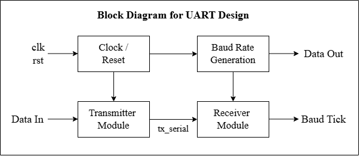
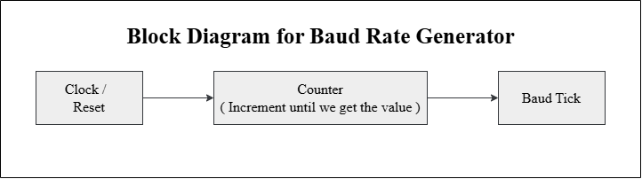
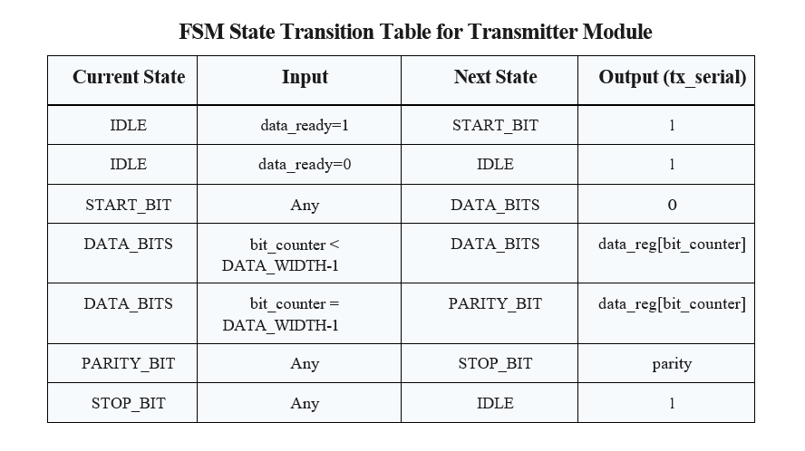
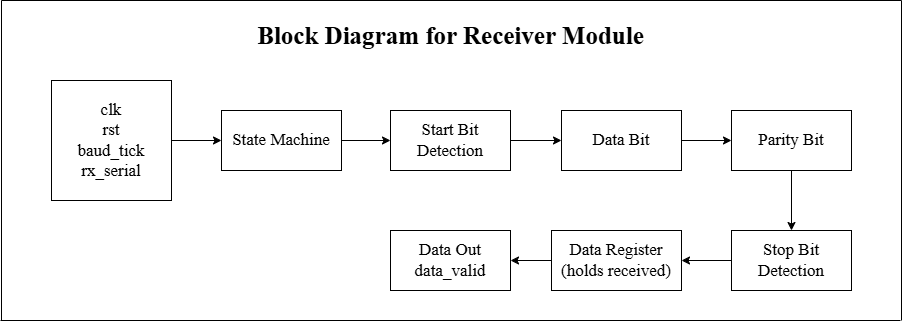
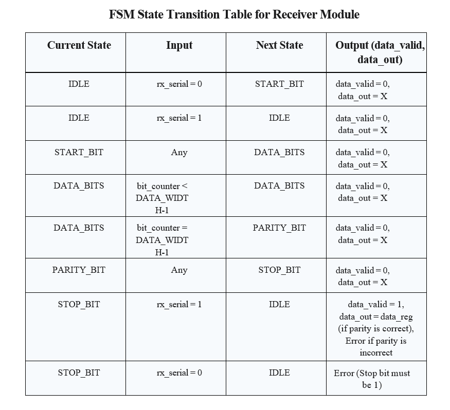
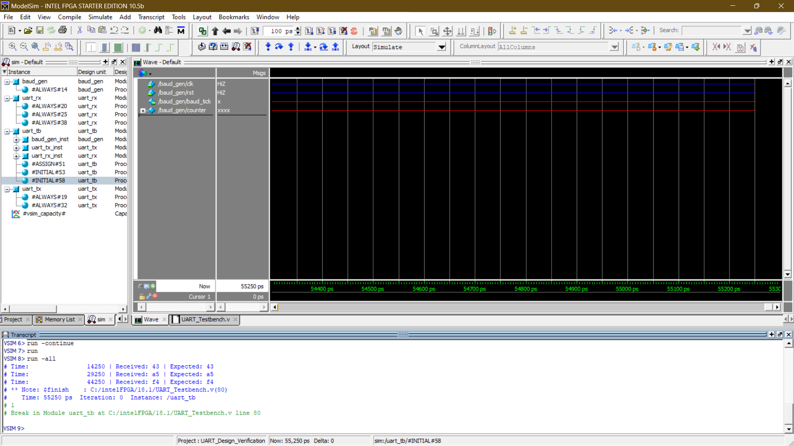
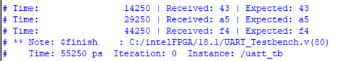

# UART
> Universal Asynchronous Receiver-Transmitter — FSM-Based RTL Implementation in Verilog

<h2>🔍 Overview</h2>

- Implemented a complete UART communication system in Verilog with 3 separate modules — **Baud Rate Generator**, **Transmitter**, and **Receiver** — each built using FSM-based architecture with parameterized data width and baud rate configuration.
- Verified using **ModelSim** in loopback mode — transmitting 5 data bytes (0x43, 0xA5, 0xF4 and more) through the TX serial line directly into the RX module, confirming all received data matched expected values with parity verification.

<h2>⚙️ Module Architecture</h2>

| Module | Description |
|:---|:---|
| Baud Rate Generator | Parameterized clock divider — generates baud_tick at CLK_FREQ/BAUD_RATE ratio |
| Transmitter (uart_tx) | FSM — serializes parallel data with start, data, parity, and stop bits |
| Receiver (uart_rx) | FSM — deserializes serial data with parity verification and data_valid flag |
| Testbench (uart_tb) | Loopback — tx_serial connected directly to rx_serial for end-to-end verification |

<h2>📐 Design Details</h2>

**1. Baud Rate Generator** &nbsp;|&nbsp; `CLK_FREQ` `BAUD_RATE` `Counter` `baud_tick`

Parameterized clock divider module — counts up to `CLK_FREQ / BAUD_RATE` cycles and generates a single-cycle `baud_tick` pulse at the target baud rate. Default parameters: CLK_FREQ = 10,000, BAUD_RATE = 1,000 (10x ratio). Uses `$clog2` for automatic counter width calculation.

**2. Transmitter Module** &nbsp;|&nbsp; `FSM` `Parity` `tx_serial` `data_ready`

5-state FSM transmitter — triggered by `data_ready` signal. Serializes 8-bit parallel input data LSB-first with odd parity bit. Holds `tx_serial` high (idle) between transmissions. State transitions clocked by `baud_tick`.

| State | Action |
|:---|:---|
| IDLE | tx_serial = 1, wait for data_ready |
| START_BIT | tx_serial = 0, load data_reg, compute parity |
| DATA_BITS | Serialize data_reg[bit_counter], increment counter |
| PARITY_BIT | tx_serial = parity (XOR of all data bits) |
| STOP_BIT | tx_serial = 1, return to IDLE |

**3. Receiver Module** &nbsp;|&nbsp; `FSM` `Parity Check` `data_valid` `data_out`

5-state FSM receiver — detects start bit by monitoring `rx_serial` going low. Samples incoming bits on `baud_tick`, stores in `data_reg`, and verifies parity at STOP_BIT. Sets `data_valid = 1` and outputs `data_out` only if parity matches. Displays error messages for parity or stop bit failures.

| State | Action |
|:---|:---|
| IDLE | Wait for rx_serial = 0 (start bit) |
| START_BIT | Initialize bit_counter |
| DATA_BITS | Sample rx_serial into data_reg[bit_counter] |
| PARITY_BIT | Store received parity bit |
| STOP_BIT | Verify parity, assert data_valid if correct |

<h2>📊 Design Parameters</h2>

| Parameter | Value |
|:---|:---|
| Data Width | 8 bits (parameterized) |
| Clock Frequency | 10,000 Hz (simulation) |
| Baud Rate | 1,000 bps (simulation) |
| Parity | Odd parity (XOR of all data bits) |
| UART Frame | Start + 8 Data + Parity + Stop = 11 bits |
| Test Vectors | 0x43, 0x72, 0xA5, 0xE7, 0xF4 |
| Simulation Mode | Loopback (tx_serial → rx_serial) |

<h2>🖼️ Implementation Results</h2>

### 1. UART Block Diagram

### 2. Baud Rate Generator Block Diagram

### 3. Transmitter Module Block Diagram

### 4. FSM State Transition Table — Transmitter Module

### 5. Receiver Module Block Diagram

### 6. FSM State Transition Table — Receiver Module

### 7. ModelSim Simulation — Waveform & Transcript

### 8. ModelSim Simulation — Received vs Expected Results

<h2>🔗 Navigation</h2>

[Back to Repository Overview](../README.md) &nbsp;|&nbsp; [Next : 02 : FIFO](../02%20:%20FIFO/README.md)
