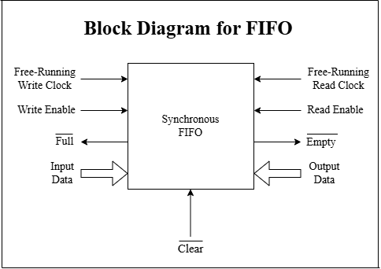
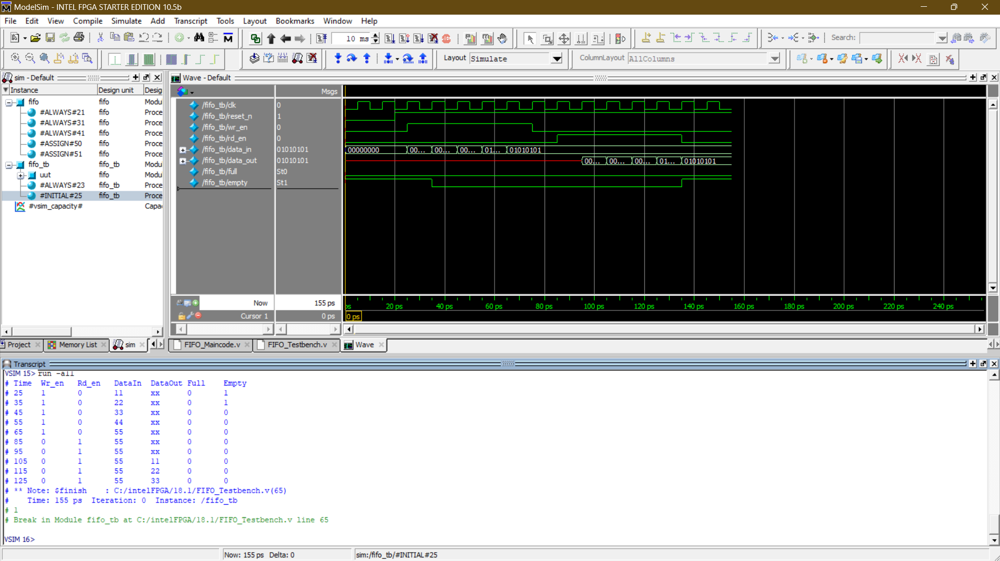
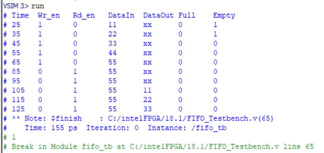

# FIFO
> Synchronous First-In First-Out Memory — Parameterized RTL Implementation in Verilog

<h2>🔍 Overview</h2>

- Implemented a parameterized synchronous FIFO in Verilog with configurable data width, depth, and pointer width — featuring separate write and read pointer logic, counter-based full/empty flag generation, and active-low reset.
- Verified using **ModelSim** — testbench writes 5 values (0x11, 0x22, 0x33, 0x44, 0x55) into the FIFO and reads them back sequentially, confirming correct FIFO ordering, full/empty flag behavior, and data integrity across all operations.

<h2>⚙️ Module Architecture</h2>

| Block | Description |
|:---|:---|
| Memory Array | `reg [WIDTH-1:0] mem [0:DEPTH-1]` — circular buffer |
| Write Logic | Increments wr_ptr and writes data_in when wr_en=1 and not full |
| Read Logic | Increments rd_ptr and outputs mem[rd_ptr] when rd_en=1 and not empty |
| Counter Logic | Tracks number of valid entries — increments on write, decrements on read |
| Full Flag | `assign full = (count == DEPTH)` |
| Empty Flag | `assign empty = (count == 0)` |

<h2>📐 Design Details</h2>

**1. Write Logic** &nbsp;|&nbsp; `wr_en` `wr_ptr` `full` `data_in`

On every rising clock edge — if `wr_en` is asserted and FIFO is not full, `data_in` is written to `mem[wr_ptr]` and `wr_ptr` is incremented. Write pointer wraps around automatically due to fixed-width counter arithmetic, implementing the circular buffer behavior.

**2. Read Logic** &nbsp;|&nbsp; `rd_en` `rd_ptr` `empty` `data_out`

On every rising clock edge — if `rd_en` is asserted and FIFO is not empty, `data_out` is loaded from `mem[rd_ptr]` and `rd_ptr` is incremented. Read pointer wraps independently of write pointer, enabling simultaneous read and write operations without data corruption.

**3. Counter & Flag Logic** &nbsp;|&nbsp; `count` `full` `empty` `simultaneous RW`

A separate counter tracks the number of valid entries in the FIFO — incremented on write-only, decremented on read-only, and unchanged on simultaneous read-write. `full` asserted when `count == DEPTH`, `empty` asserted when `count == 0`.

<h2>📊 Design Parameters</h2>

| Parameter | Value |
|:---|:---|
| Data Width | 8 bits (parameterized — WIDTH) |
| FIFO Depth | 8 entries (parameterized — DEPTH) |
| Pointer Width | 3 bits (parameterized — PTR_WIDTH) |
| Reset | Active-low (reset_n) |
| Write Test Data | 0x11, 0x22, 0x33, 0x44, 0x55 |
| Simulation End | 155 ps |

<h2>📊 ModelSim Results</h2>

| Time (ps) | Wr_en | Rd_en | DataIn | DataOut | Full | Empty |
|:---|:---|:---|:---|:---|:---|:---|
| 25 | 1 | 0 | 11 | xx | 0 | 1 |
| 35 | 1 | 0 | 22 | xx | 0 | 0 |
| 45 | 1 | 0 | 33 | xx | 0 | 0 |
| 55 | 1 | 0 | 44 | xx | 0 | 0 |
| 65 | 1 | 0 | 55 | xx | 0 | 0 |
| 85 | 0 | 1 | 55 | xx | 0 | 0 |
| 95 | 0 | 1 | 55 | xx | 0 | 0 |
| 105 | 0 | 1 | 55 | 11 | 0 | 0 |
| 115 | 0 | 1 | 55 | 22 | 0 | 0 |
| 125 | 0 | 1 | 55 | 33 | 0 | 0 |

<h2>🖼️ Implementation Results</h2>

### 1. FIFO Block Diagram

### 2. ModelSim Simulation — Waveform & Transcript

### 3. ModelSim Simulation — Write & Read Results

<h2>🔗 Navigation</h2>

[Back to Repository Overview](../README.md) &nbsp;|&nbsp; [Previous : 01 : UART](../01%20:%20UART/README.md) &nbsp;|&nbsp; [Next : 03 : Traffic Light Controller](../03%20:%20Traffic%20Light%20Controller/README.md)
