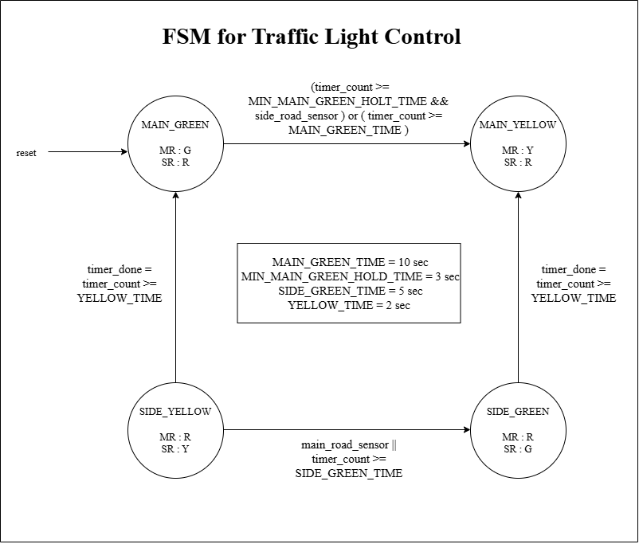
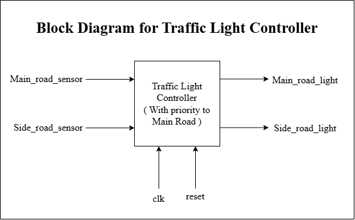
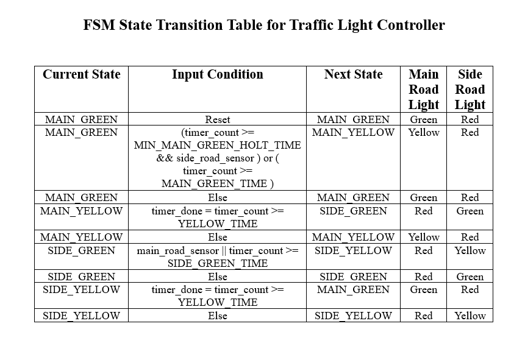
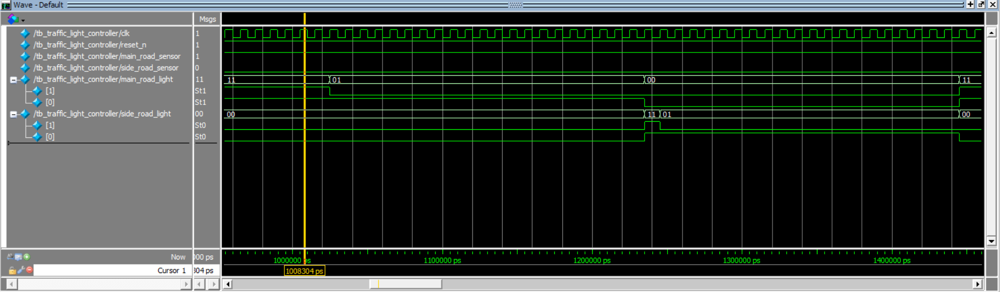
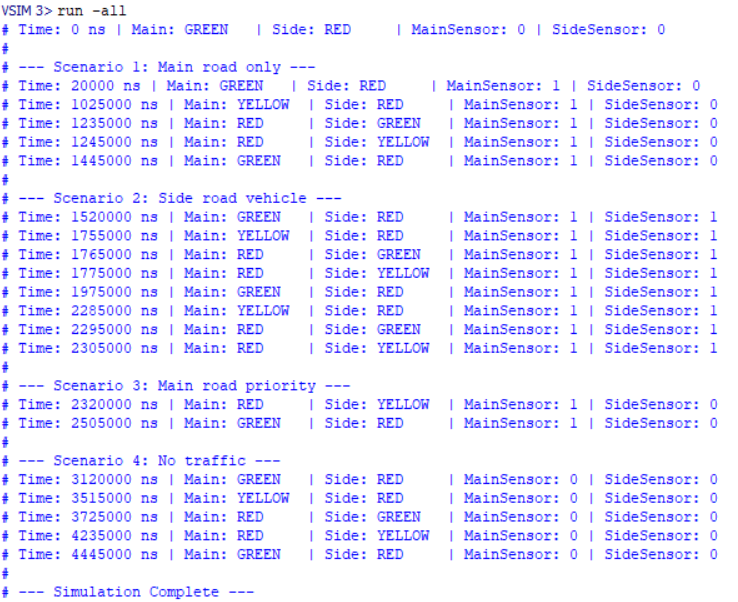

# Traffic Light Controller
> Sensor-Driven, Timer-Based FSM with Main Road Priority — Verified on ModelSim

<h2>🔍 Overview</h2>

- Designed a **sensor-driven, timer-based Traffic Light Controller** in Verilog using a 4-state Mealy FSM — with priority given to the main road through a configurable minimum hold time before side road access is granted.
- Implemented **dual transition logic** — state transitions triggered either by timer expiry or real-time sensor inputs, enabling early green-phase exits when side road traffic is detected.
- Verified using **ModelSim** across 4 scenarios — timer-only cycling, sensor-triggered early exit, main road priority recovery, and no-traffic idle operation — all state transitions confirmed correct.

<h2>⚙️ Module Architecture</h2>

| Block | Description |
|:---|:---|
| State Register | Sequential block — updates `current_state` and `timer_count` on `posedge clk` or `negedge reset_n` |
| Timer Done Logic | Combinational block — asserts `timer_done` when `timer_count` reaches threshold for current state |
| Next State Logic | Combinational block — evaluates timer and sensor conditions to determine `next_state` |
| Output Logic | Combinational block — drives `main_road_light` and `side_road_light` based on `current_state` |

<h2>📐 Design Details</h2>

**1. FSM States & Light Encoding** &nbsp;|&nbsp; `localparam` `2-bit encoding` `GREEN=2'b11`

Four states encoded in 2-bit binary — `MAIN_GREEN (2'd0)`, `MAIN_YELLOW (2'd1)`, `SIDE_GREEN (2'd2)`, `SIDE_YELLOW (2'd3)`. Light outputs encoded as `GREEN = 2'b11`, `YELLOW = 2'b01`, `RED = 2'b00` — both roads default to RED on reset.

**2. Timer & Transition Logic** &nbsp;|&nbsp; `timer_count` `timer_done` `MIN_MAIN_GREEN_HOLD_TIME`

A 32-bit counter increments every clock cycle and resets when `timer_done` is asserted. In `MAIN_GREEN`, transition to `MAIN_YELLOW` occurs either when `timer_count >= MAIN_GREEN_TIME` or when `timer_count >= MIN_MAIN_GREEN_HOLD_TIME && side_road_sensor` — enforcing main road priority while allowing sensor-driven early exit.

**3. Side Road Priority & Early Exit** &nbsp;|&nbsp; `main_road_sensor` `SIDE_GREEN` `timer_done`

In `SIDE_GREEN`, transition to `SIDE_YELLOW` is triggered when `timer_done` OR `main_road_sensor` is asserted — allowing the main road to reclaim green phase immediately when traffic is detected, without waiting for the full side road timer to expire.

<h2>📊 Design Parameters</h2>

| Parameter | Cycles | Simulation Time |
|:---|:---|:---|
| `MAIN_GREEN_TIME` | 100 | 1000 ns |
| `YELLOW_TIME` | 20 | 200 ns |
| `SIDE_GREEN_TIME` | 50 | 500 ns |
| `MIN_MAIN_GREEN_HOLD_TIME` | 30 | 300 ns |

<h2>📊 ModelSim Results</h2>

| Time (ns) | Main Light | Side Light | MainSensor | SideSensor | Event |
|:---|:---|:---|:---|:---|:---|
| 0 | GREEN | RED | 0 | 0 | Reset released |
| 20000 | GREEN | RED | 1 | 0 | Scenario 1 start |
| 1025000 | YELLOW | RED | 1 | 0 | MAIN_GREEN timer expired |
| 1235000 | RED | GREEN | 1 | 0 | SIDE_GREEN entered |
| 1245000 | RED | YELLOW | 1 | 0 | SIDE_GREEN timer expired |
| 1445000 | GREEN | RED | 1 | 0 | Back to MAIN_GREEN |
| 1520000 | GREEN | RED | 1 | 1 | Scenario 2 — side sensor detected |
| 1755000 | YELLOW | RED | 1 | 1 | Early exit from MAIN_GREEN |
| 2320000 | RED | YELLOW | 1 | 0 | Scenario 3 — main road priority |
| 2505000 | GREEN | RED | 1 | 0 | Main road restored |
| 3120000 | GREEN | RED | 0 | 0 | Scenario 4 — no traffic |
| 4445000 | GREEN | RED | 0 | 0 | Full timer cycle complete |

<h2>🖼️ Implementation Results</h2>

### 1. FSM State Diagram

### 2. Block Diagram

### 3. FSM State Transition Table

### 4. ModelSim Simulation — Waveform

### 5. ModelSim Simulation — Transcript

<h2>🔗 Navigation</h2>

[Back to Repository Overview](../README.md) &nbsp;|&nbsp; [Previous : 02 : FIFO](../02%20:%20FIFO/README.md) &nbsp;|&nbsp; [Next : 04 : Automatic Temperature Control](../04%20:%20Automatic%20Temperature%20Control/README.md)
