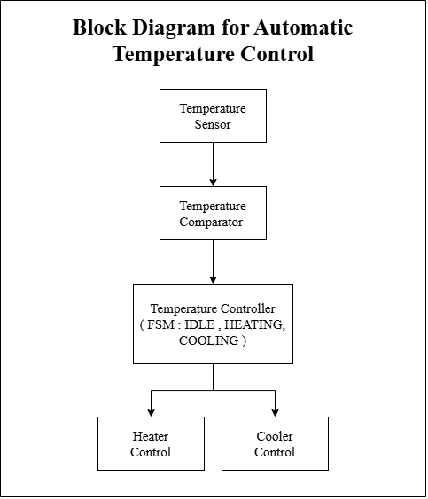
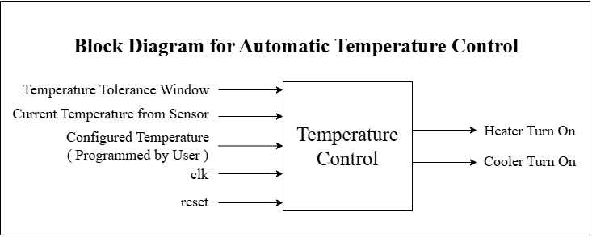
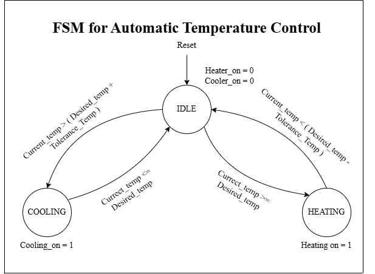
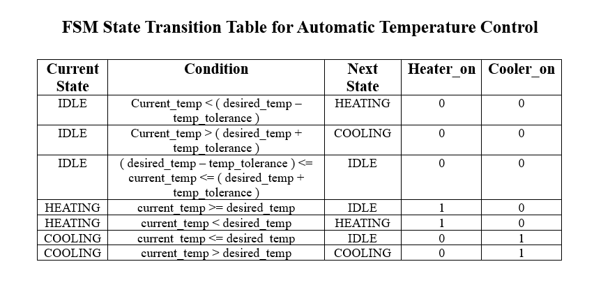
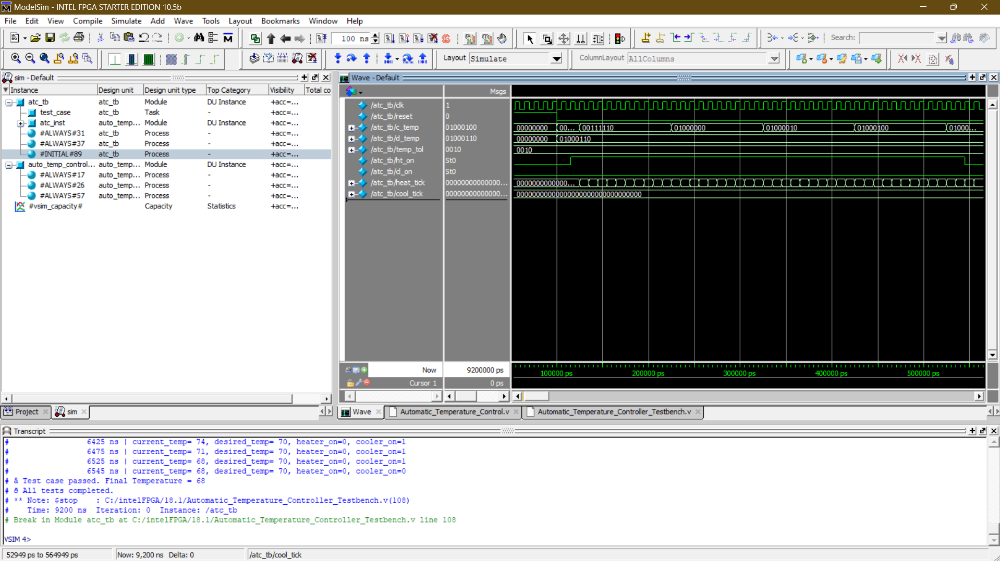
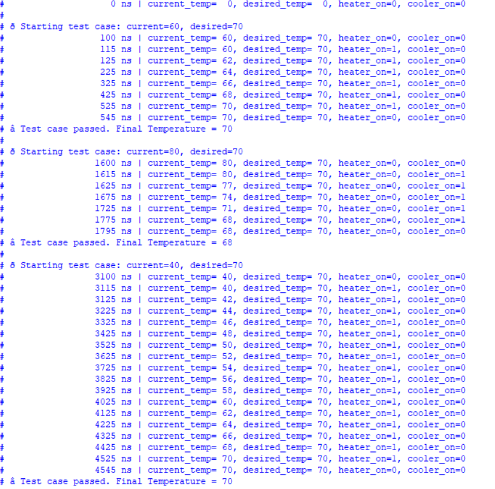
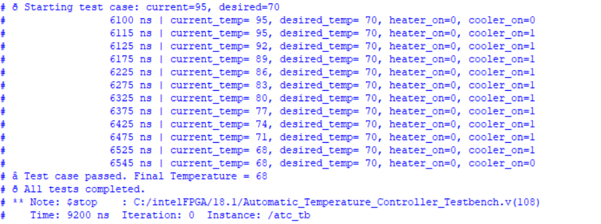

# Automatic Temperature Control
> FSM-Based Automatic Temperature Controller — One-Hot Encoded RTL Implementation in Verilog

<h2>🔍 Overview</h2>

- Implemented a 3-state one-hot FSM automatic temperature controller in Verilog — monitoring current temperature against a desired setpoint with a configurable tolerance window, and activating heater or cooler outputs accordingly.
- Verified using **ModelSim** with 4 automated test cases — heating up (60→70°C), cooling down (80→70°C), cold winter (40→70°C), and hot summer (95→70°C) — all 4 test cases passed with final temperatures stabilizing within the tolerance window at simulation end time of 9,200 ns.

<h2>⚙️ Module Architecture</h2>

| Block | Description |
|:---|:---|
| State Register | Sequential block — updates state on posedge clk or posedge reset |
| Next State Logic | Combinational block — determines transitions based on temperature comparison |
| Output Logic | Sequential block — controls heater_on and cooler_on based on current state |

<h2>📐 Design Details</h2>

**1. FSM States & Encoding** &nbsp;|&nbsp; `One-Hot` `IDLE` `HEATING` `COOLING`

3-state one-hot FSM with binary encoding:

| State | Encoding | heater_on | cooler_on |
|:---|:---|:---|:---|
| IDLE | 3'b001 | 0 | 0 |
| HEATING | 3'b010 | 1 | 0 |
| COOLING | 3'b100 | 0 | 1 |

**2. Next State Logic** &nbsp;|&nbsp; `Temperature Comparator` `Tolerance Window` `Transitions`

Combinational block determines next state based on temperature comparison:

| Current State | Condition | Next State |
|:---|:---|:---|
| IDLE | current_temp < (desired_temp − tolerance) | HEATING |
| IDLE | current_temp > (desired_temp + tolerance) | COOLING |
| IDLE | Within tolerance window | IDLE |
| HEATING | current_temp >= desired_temp | IDLE |
| HEATING | current_temp < desired_temp | HEATING |
| COOLING | current_temp <= desired_temp | IDLE |
| COOLING | current_temp > desired_temp | COOLING |

**3. Testbench Environment Simulation** &nbsp;|&nbsp; `Auto Test Cases` `Pass/Fail` `Environment Model`

Testbench simulates real thermal environment behavior — heater increments temperature by 2°C every 10 clock cycles, cooler decrements by 3°C every 5 clock cycles. Automated `test_case` task validates each scenario with pass/fail display.

<h2>📊 Design Parameters</h2>

| Parameter | Value |
|:---|:---|
| Current Temperature | 8-bit input |
| Desired Temperature | 8-bit input |
| Temperature Tolerance | 4-bit input |
| Tolerance Value (TB) | ±2°C |
| Heater Step | +2°C every 10 cycles |
| Cooler Step | −3°C every 5 cycles |
| Clock Period | 10 ns |
| Total Simulation Time | 9,200 ns |

<h2>✅ Test Results</h2>

| Test Case | Initial Temp | Desired Temp | Action | Final Temp | Result |
|:---|:---|:---|:---|:---|:---|
| 1 | 60°C | 70°C | HEATING | 70°C | ✅ Passed |
| 2 | 80°C | 70°C | COOLING | 68°C | ✅ Passed |
| 3 | 40°C | 70°C | HEATING | 70°C | ✅ Passed |
| 4 | 95°C | 70°C | COOLING | 68°C | ✅ Passed |

<h2>🖼️ Implementation Results</h2>

### 1. System-Level Block Diagram

### 2. RTL Port-Level Block Diagram

### 3. FSM State Transition Diagram

### 4. FSM State Transition Table

### 5. ModelSim Simulation — Waveform

### 6. ModelSim Simulation — Test Cases 1, 2 & 3

### 7. ModelSim Simulation — Test Case 4 & All Tests Completed

<h2>🔗 Navigation</h2>

[Back to Repository Overview](../README.md) &nbsp;|&nbsp; [Previous : 03 : Traffic Light Controller](../03%20:%20Traffic%20Light%20Controller/README.md) &nbsp;|&nbsp; [Next : 05 : Washing Machine Controller](../05%20:%20Washing%20Machine%20Controller/README.md)
