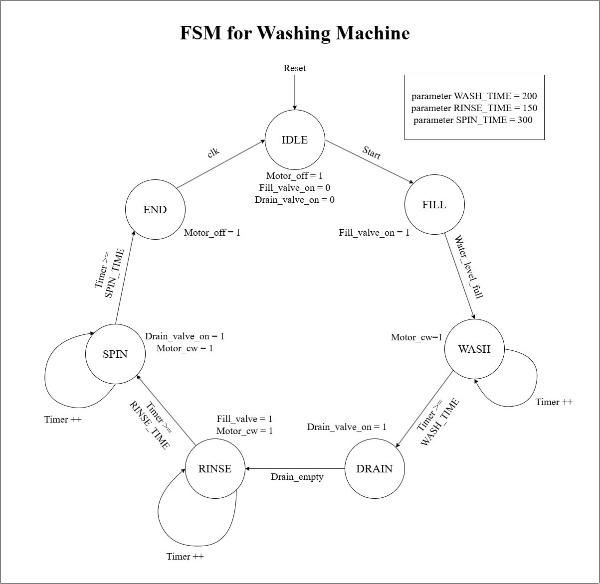
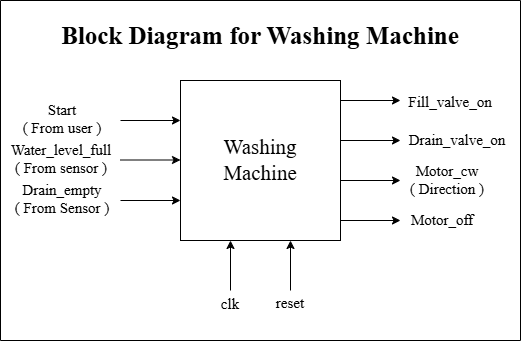
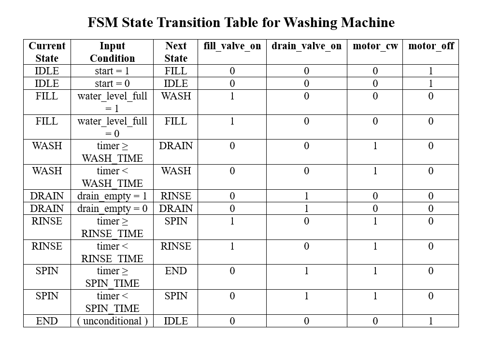
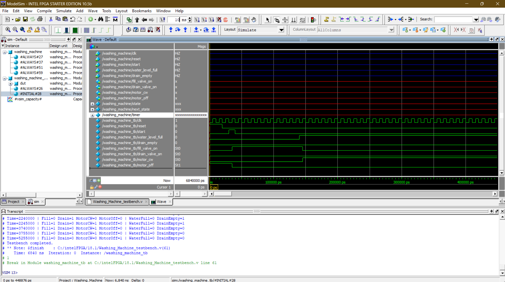
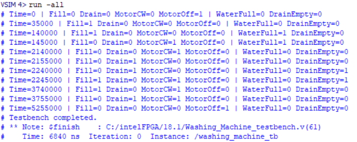

# Washing Machine Controller
> 7-State FSM Washing Machine Controller — Timer-Driven RTL Implementation in Verilog

<h2>🔍 Overview</h2>

- Implemented a 7-state FSM washing machine controller in Verilog — progressing through a complete wash cycle (IDLE → FILL → WASH → DRAIN → RINSE → SPIN → END) with timer-driven state transitions for timed phases and sensor-driven transitions for water level and drain status.
- Verified using **ModelSim** — testbench simulates a complete wash cycle with water level and drain sensor inputs, confirming correct sequential state transitions and output signals for all valves and motor controls, completing simulation at 6,840 ns.

<h2>⚙️ Module Architecture</h2>

| Block | Description |
|:---|:---|
| Timer Logic | Sequential block — increments during WASH, RINSE, SPIN states; resets otherwise |
| Next State Logic | Combinational block — sensor-driven for FILL/DRAIN, timer-driven for WASH/RINSE/SPIN |
| State Register | Sequential block — updates state on posedge clk or posedge reset |
| Output Logic | Combinational block — controls fill_valve, drain_valve, motor_cw, motor_off |

<h2>📐 Design Details</h2>

**1. FSM States & Output Logic** &nbsp;|&nbsp; `7 States` `Valves` `Motor Control`

| State | fill_valve_on | drain_valve_on | motor_cw | motor_off |
|:---|:---|:---|:---|:---|
| IDLE | 0 | 0 | 0 | 1 |
| FILL | 1 | 0 | 0 | 0 |
| WASH | 0 | 0 | 1 | 0 |
| DRAIN | 0 | 1 | 0 | 0 |
| RINSE | 1 | 0 | 1 | 0 |
| SPIN | 0 | 1 | 1 | 0 |
| END | 0 | 0 | 0 | 1 |

**2. State Transitions** &nbsp;|&nbsp; `Sensor-Driven` `Timer-Driven`

| Current State | Condition | Next State |
|:---|:---|:---|
| IDLE | start = 1 | FILL |
| FILL | water_level_full = 1 | WASH |
| WASH | timer >= WASH_TIME (200) | DRAIN |
| DRAIN | drain_empty = 1 | RINSE |
| RINSE | timer >= RINSE_TIME (150) | SPIN |
| SPIN | timer >= SPIN_TIME (300) | END |
| END | unconditional | IDLE |

**3. Timer Logic** &nbsp;|&nbsp; `WASH_TIME` `RINSE_TIME` `SPIN_TIME`

16-bit timer increments on every rising clock edge during WASH, RINSE, and SPIN states — resets to 0 in all other states. Timer-based transitions trigger when count reaches the configured time parameter, controlling cycle duration independently for each timed phase.

<h2>📊 Design Parameters</h2>

| Parameter | Value |
|:---|:---|
| WASH_TIME | 200 clock cycles |
| RINSE_TIME | 150 clock cycles |
| SPIN_TIME | 300 clock cycles |
| Timer Width | 16-bit |
| Clock Period | 10 ns |
| Total Simulation Time | 6,840 ns |

<h2>📊 ModelSim Results</h2>

| Time (ns) | Fill | Drain | MotorCW | MotorOff | State |
|:---|:---|:---|:---|:---|:---|
| 0 | 0 | 0 | 0 | 1 | IDLE |
| 35,000 | 1 | 0 | 0 | 0 | FILL |
| 140,000 | 1 | 0 | 0 | 0 | FILL (water filling) |
| 145,000 | 0 | 0 | 1 | 0 | WASH |
| 2,140,000 | 0 | 0 | 1 | 0 | WASH continuing |
| 2,155,000 | 0 | 1 | 0 | 0 | DRAIN |
| 2,240,000 | 0 | 1 | 0 | 0 | DRAIN continuing |
| 2,245,000 | 1 | 0 | 1 | 0 | RINSE |
| 3,740,000 | 1 | 0 | 1 | 0 | RINSE continuing |
| 3,755,000 | 0 | 1 | 1 | 0 | SPIN |
| 5,255,000 | 0 | 0 | 0 | 1 | END → IDLE |

<h2>🖼️ Implementation Results</h2>

### 1. FSM State Transition Diagram

### 2. RTL Port-Level Block Diagram

### 3. FSM State Transition Table

### 4. ModelSim Simulation — Waveform & Transcript

### 5. ModelSim Simulation — Full Cycle Results

<h2>🔗 Navigation</h2>

[Back to Repository Overview](../README.md) &nbsp;|&nbsp; [Previous : 04 : Automatic Temperature Control](../04%20:%20Automatic%20Temperature%20Control/README.md)
